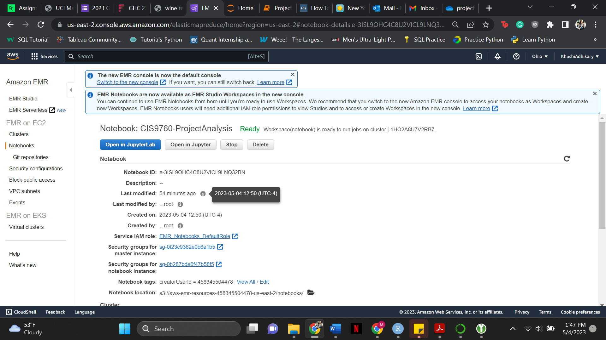

# Analyzing IMDB Datasets

Here, we used the Amazon Elastic Map Reduce (EMR) to conduct some analysis by using the Spark tools. We created a cluster and completed our analysis within the Jupyter notebook.  

This analysis was about exploring IMDb and finding out answers to questions including but not limited to: 

1. Number of Movies acted by Zendaya per year. 
2. Movies starring Johnny Depp and Helena Bonham Carter. 
3. Movies by Brad Pitt after 2010. 

### Here is the cluster and notebook configuration:

* Cluster configuration:

* Notebook configuration:

